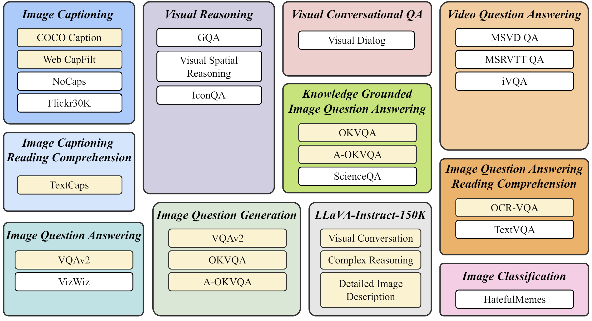
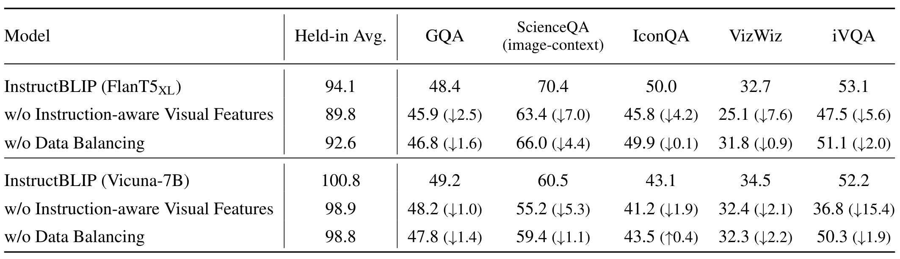

**Title**: InstructBLIP: Towards General-purpose Vison-Language Models with Instruction Tuning
**Venue**: NeurIPS 2023

**Reviewer**: HyeongJun Do
**Last Updated**: 26.06.2024
**Reference**
> Paper Link: [https://arxiv.org/abs/2305.06500](https://arxiv.org/abs/2305.06500)  
> Neurips 2023: [https://neurips.cc/virtual/2023/poster/70085](https://neurips.cc/virtual/2023/poster/70085)
> Github: [https://github.com/salesforce/LAVIS/tree/main/projects/instructblip](https://github.com/salesforce/LAVIS/tree/main/projects/instructblip)

**A Brief Overview**
- **Objective**: Vision-language 모델을 instruction tuning을 통해 다양한 작업에 일반화할 수 있는 모델로 개선함.
- **Key Contributions**:
  - Vision-language instruction tuning 프레임워크 제안함.
  - Instruction-aware query transformer 개발함.
  - 26개의 공개 데이터셋을 사용한 종합적인 실험 수행함.
  - 개인적으로는 기존 BLIP2에서 Text 부분만 Instruction으로 바꿨더니 성능이 높아지는 것 정도로만 생각됨.

## A Brief Overview
- **Objective**: Vision-language 모델을 instruction tuning을 통해 다양한 작업에 일반화할 수 있는 모델로 개선함.
- **Key Contributions**:
  - **지시문 기반의 튜닝**: InstructBLIP는 다양한 지시문 데이터를 사용하여 모델을 훈련시키며, 이를 통해 특정 작업에 필요한 시각적 정보를 효과적으로 추출하도록 설계됨.
  - **다양한 데이터셋 사용**: 이 모델은 26개의 공개 데이터셋을 사용하여 훈련되었으며, 이를 통해 모델의 일반화 성능을 높였음. 특히, 지시문 기반의 시각적 특징 추출을 통해 새로운 데이터셋에서도 높은 성능을 보임.
  - **최신 성능**: InstructBLIP는 13개의 테스트 데이터셋에서 BLIP-2 및 Flamingo 모델보다 뛰어난 제로샷(zero-shot) 성능을 보여주며, 개별 다운스트림 작업에서도 최고의 성능을 기록함. 예를 들어, ScienceQA IMG에서 90.7%의 정확도를 달성함.
  - **구조적 유연성**: BLIP-2의 모듈형 아키텍처 덕분에 InstructBLIP는 다양한 대형 언어 모델(LLM)과 결합될 수 있음. 이 모델은 ViT-g/14 이미지 인코더와 여러 LLM(FlaT5-XL, FlanT5-XXL, Vicuna-7B, Vicuna-13B)을 결합하여 실험되었음.

## 1. Introduction
- **Problem Statement**: 단일 모델이 사용자가 지정한 다양한 작업을 해결할 수 있도록 하는 것이 목표임. NLP에서는 instruction tuning이 이 목표를 달성하는 데 효과적이었으나, 시각-언어 모델에서는 다양한 입력 모달리티 때문에 더 큰 도전 과제가 존재함.
- **Background**: 대형 언어 모델(LLM)은 instruction tuning을 통해 다양한 작업을 수행할 수 있게 되었음. 하지만 시각-언어 작업은 시각적 입력과 텍스트 입력을 함께 이해하고 처리해야 하기 때문에 복잡성이 증가함.
- **Solution**: InstructBLIP는 시각-언어 instruction tuning 프레임워크로, 다양한 시각-언어 작업을 자연어 명령을 통해 해결할 수 있음.

## 2. Related Work
### 2.1 Vision-Language Pre-training Models
- **Methods**:
  - **Image-Text Contrastive Learning**: 이미지와 텍스트를 공유된 의미 공간에 정렬함.
  - **Language Modeling Based Tasks**: 캡션 생성 및 VQA와 같은 작업을 통해 모델을 미세 조정함.
- **Challenges**: 기존 방법은 시각적 및 텍스트 모달리티 간의 상호작용을 세밀하게 처리하지 못하거나, 학습 및 추론 시 비효율적임.

### 2.2 Multi-Modality Interaction Mechanism
- **Single-Stream Models**: 시각적 및 텍스트 입력을 직접 결합함.
- **Dual-Stream Models**: 시각적 및 텍스트 입력을 별도의 인코더로 처리함.
- **InstructBLIP's Approach**: Dual-Stream 모델과 새로운 상호작용 메커니즘을 사용하여 모달리티 간의 세밀한 관계를 캡처함.

## 3. Method
- **Model Architecture**: Transformer 기반 dual-stream 아키텍처로, 이미지 및 텍스트 인코더 사용함.
- **Instruction Tuning**:
  - 26개의 공개 데이터셋을 instruction tuning 포맷으로 변환함.
  - 데이터셋을 11개의 작업 카테고리로 그룹화함.
- **Feature Extraction**: 명령어에 따른 시각적 특징을 추출하는 instruction-aware visual feature extraction 메커니즘 도입함.

### 3.1 Vision-Language Instruction Tuning
#### 3.1.1 Tasks and Datasets
- 26개의 공개된 시각-언어 데이터셋을 수집하고 이를 Instruction Tuning 포맷으로 변환함.
- 최종 데이터셋은 11개의 작업 카테고리로 구성됨.

  

**Figure 1**
**설명**: InstructBLIP Vicuna 모델이 생성한 다양한 예시를 보여줌. 이미지 캡션 생성, 복잡한 시각적 장면 이해 및 추론, 지식 기반 이미지 설명, 멀티턴 비주얼 대화 등 InstructBLIP의 다양한 기능을 보여줌. 예를 들어, 허리케인 피해를 입은 지역을 묘사하는 이미지에서 InstructBLIP은 야자수를 보고 이 지역이 열대 또는 아열대 지역일 수 있다고 추론함. 또한, 유명한 그림 '진주 귀걸이를 한 소녀'를 설명하고, 그림 속 인물의 감정과 의도에 대한 질문에 답변하는 등 다양한 능력을 보여줌.

#### 3.1.2 Training and Evaluation Protocols
- 26개의 데이터셋을 13개의 훈련 데이터셋과 13개의 평가 데이터셋으로 나눔.
- Instruction Tuning 동안 모든 훈련 세트를 혼합하여 각 데이터셋에 대해 명령어 템플릿을 균일하게 샘플링함.

#### 3.1.3 Instruction-aware Visual Feature Extraction
- 기존의 제로샷 이미지-텍스트 생성 방법은 시각 특징을 추출할 때 명령어를 고려하지 않지만, InstructBLIP는 주어진 명령어에 맞춰 시각 특징을 추출하여 LLM에 전달함.

  

**Figure 2**
**설명**: 비전 언어 명령어 튜닝에 사용된 작업 및 해당 데이터셋을 보여줌. 노란색으로 표시된 데이터셋은 튜닝에 사용되었고 (held-in), 흰색으로 표시된 데이터셋은 튜닝에 사용되지 않고 모델의 zero-shot 성능 평가에 사용되었음 (held-out). 이미지 캡션 생성, 시각적 추론, 이미지 질문 답변, 지식 기반 이미지 질문 답변, 이미지 질문 생성, 비디오 질문 답변, 시각적 대화 질문 답변, 이미지 분류 등 다양한 작업과 데이터셋이 포함되어 있음.

  

**Figure 3**
**설명**: InstructBLIP 모델의 구조를 보여줌. 이미지 인코더, Q-Former, LLM으로 구성되며, Q-Former는 이미지 인코더에서 추출한 시각적 특징을 LLM에 전달하는 역할을 함. 또한, instruction-aware Q-Former는 주어진 명령어에 따라 시각적 특징을 추출하여 LLM에 제공함으로써 모델이 명령어를 더 잘 따를 수 있도록 돕음.

#### 3.1.4 Balancing Training Datasets
- **데이터셋 크기와 샘플링**: InstructBLIP의 훈련에서 각 데이터셋의 크기는 다양함. 큰 데이터셋은 더 많은 샘플을 제공하지만, 이는 특정 데이터셋의 과적합을 초래할 수 있음. 이를 방지하기 위해, 데이터셋 크기에 따라 샘플링 확률을 조정함. 작은 데이터셋에서 더 많은 샘플을 뽑고, 큰 데이터셋에서 상대적으로 적은 샘플을 뽑아 균형을 맞춤.

- **균형 샘플링 전략**: 이 전략은 모든 데이터셋이 모델 훈련에 균등하게 기여하도록 보장함. 데이터셋의 다양성을 유지하면서도 과적합 및 과소적합 문제를 해결하는 데 중요한 역할을 함.

- **구체적인 방법**
    - 데이터셋 크기를 기준으로 샘플링 확률을 계산함.
    - 각 훈련 배치에서 데이터셋의 샘플링 비율을 조정하여, 모델이 다양한 데이터셋에 대한 일반화 능력을 갖추도록 함.
    - Table 2 결과 참고

#### 3.1.5 Inference Methods
- **생성 접근 방식**: InstructBLIP는 다양한 데이터셋을 평가하기 위해 두 가지 생성 접근 방식을 사용함. 첫 번째 접근 방식은 제로샷 설정으로, 모델이 미리 보지 못한 데이터에 대해 직접 추론을 수행함. 두 번째 접근 방식은 훈련된 데이터셋을 기반으로 하여 모델이 학습한 내용을 평가함.

- **제로샷 평가**
    - 모델은 특정 작업이나 데이터셋에 대해 사전 훈련 없이 즉시 추론을 수행함.
    이는 모델의 일반화 능력을 평가하는 중요한 방법임.

- **파인튜닝 평가**
    - 모델은 특정 데이터셋에 대해 미세 조정(finetuning)을 거친 후 평가함.
    - 이는 모델이 특정 작업에 대해 더 높은 정확도를 달성할 수 있도록 함.
- **구체적인 방법**
    - 각 접근 방식에서 모델의 성능을 측정하고, 다양한 데이터셋에서의 성능 차이를 분석함.
    - 이를 통해 모델의 강점과 약점을 파악하고, 향후 개선 방향을 제시함.
- Table 1 결과 확인

#### 3.1.6 Implementation Details

InstructBLIP 모델의 구현은 Vision Transformer (ViT)와 다양한 대형 언어 모델(LLM)을 결합하여 이루어졌음. 구체적인 구현 세부사항은 다음과 같음.

##### Image Encoder
- **Vision Transformer (ViT)**: InstructBLIP는 ViT-g/14 모델을 이미지 인코더로 사용함. 이 인코더는 이미지를 입력으로 받아 고차원 벡터로 변환함.
  - ViT-g/14는 높은 해상도의 이미지를 처리할 수 있으며, 다양한 시각적 패턴을 효과적으로 추출할 수 있는 강력한 성능을 가짐.

##### Query-Former
- **Q-Former**: InstructBLIP에서 핵심적인 역할을 하는 모듈로, ViT로부터 추출된 시각적 특징을 받아 이를 언어 모델이 이해할 수 있는 형태로 변환함.
  - **Instruction-aware Mechanism**: Q-Former는 주어진 명령어(instruction)에 따라 시각적 특징을 조정함. 이는 모델이 명령어의 의도를 더 잘 이해하고, 시각적 정보를 그에 맞춰 처리할 수 있게 함.
  - **구조**: Q-Former는 Transformer 기반의 구조를 가지며, 이미지 패치를 입력으로 받아 명령어와 상호작용하여 최종 시각적 특징을 생성함.

##### LLM
- **FlanT5와 Vicuna**: InstructBLIP는 여러 LLM을 사용하여 실험되었음. 각각의 LLM은 모델의 다양한 언어 처리 능력을 검증하는 데 사용됨. 각 LLM 또한 Instruction Tuning을 적용한 모델들 임.
  - **FlanT5-XL(Encoder-Decoder)**: 텍스트 생성과 이해에 강력한 성능을 보이는 LLM으로, XL 버전은 더 큰 파라미터 수를 가짐.
  - **FlanT5-XXL(Encoder-Decoder)**: 더 많은 파라미터를 포함한 확장 버전으로, 보다 복잡한 텍스트 작업을 수행할 수 있음.
  - **Vicuna-7B 및 Vicuna-13B(Decoder)**: 오픈소스 LLM으로, 각각 7억과 13억 개의 파라미터를 가짐. 이 모델들은 경량화된 구조를 가지며, 다양한 언어 작업에서 강력한 성능을 발휘함. LLAMA 버전은 기억 안나지만, LLAMA에 Instruction Tuning을 적용한 모델이 Vicuna임.

##### 데이터셋 및 훈련
- **데이터셋**: 26개의 공개된 시각-언어 데이터셋을 사용하여 모델을 훈련함. 이 데이터셋들은 다양한 시각-언어 작업을 포함하고 있으며, 모델의 일반화 능력을 평가하는 데 사용됨.
  - **훈련 데이터셋**: 13개의 데이터셋을 훈련에 사용함.
  - **평가 데이터셋**: 13개의 데이터셋을 모델의 성능 평가에 사용함.

##### 최적화 및 튜닝
- **최적화 알고리즘**: AdamW를 사용하여 모델을 최적화함. 이 알고리즘은 학습률을 적응적으로 조정하여 안정적인 훈련을 보장함.
  - **학습률 스케줄링**: 초기 학습률을 높게 설정한 후 점차 줄여가는 방식으로 학습을 진행함.
- **하이퍼파라미터 튜닝**: 다양한 하이퍼파라미터를 조정하여 모델의 성능을 최적화함.
  - **배치 크기**: 실험에 따라 적절한 배치 크기를 선택함.
  - **드롭아웃 비율**: 모델의 과적합을 방지하기 위해 드롭아웃을 적용함.

##### 훈련 인프라
- **컴퓨팅 자원**: 대규모 모델 훈련을 위해 GPU 클러스터를 사용함. NVIDIA A100 GPU를 사용하여 실험을 수행함.
  - **분산 훈련**: 데이터 병렬 처리 및 모델 병렬 처리를 통해 훈련 시간을 단축하고 효율성을 극대화함.

##### 코드 및 재현성
- **코드베이스**: InstructBLIP의 구현 코드는 GitHub에 공개되어 있으며, 누구나 접근 가능함.
- **재현성**: 논문의 실험을 재현하기 위해 상세한 실험 설정과 하이퍼파라미터 정보가 제공됨.

## 4. Experimental Results and Analysis
### 4.1 Zero-shot Evaluation
- InstructBLIP 모델은 13개의 평가 데이터셋에서 이전 최첨단 모델을 능가함.

  

**Table 1**
**설명**: held-out 데이터셋에 대한 zero-shot 결과를 보여줌. InstructBLIP은 모든 데이터셋에서 이전 SOTA 모델인 BLIP-2 및 Flamingo보다 우수한 성능을 보임. 예를 들어 InstructBLIP FlanT5XL은 BLIP-2 FlanT5XL에 비해 평균 15.0%의 상대적 개선을 달성했음. 또한, InstructBLIP은 4B 매개변수만으로도 Flamingo-80B보다 6개의 모든 평가 데이터셋에서 더 나은 성능을 보임.

### 4.2 Ablation Study on Instruction Tuning Techniques
- 명령어 인식 시각 특징 추출과 데이터 균형 샘플링 전략의 중요성 조사함.

  

**Table 2**
**설명**: instruction-aware 시각적 특징 추출 및 균형 잡힌 데이터셋 샘플링 전략을 제거한 ablation study 결과를 보여줌. 두 기술 모두 모델 성능에 중요한 영향을 미치며, 특히 instruction-aware 시각적 특징 추출은 공간 및 시간적 시각적 추론이 필요한 작업에서 성능 저하를 크게 유발함.

### 4.3 Qualitative Evaluation
- 다양한 이미지와 명령어를 사용한 질적 평가에서 InstructBLIP의 복잡한 시각적 추론 능력 입증함.

  

**Figure 4**: Qualitative Examples  
**설명**: BLIP-2 FlanT5XL 백본 모델을 기반으로 명령어 튜닝과 멀티태스크 학습을 비교함. 명령어 튜닝과 멀티태스크 학습은 held-in 데이터셋에서는 유사한 성능을 보이지만, held-out 데이터셋에서는 명령어 튜닝이 훨씬 더 우수한 성능을 보임. 이는 명령어 튜닝이 모델의 zero-shot 일반화 능력을 향상시키는 핵심 요소임을 시사함.

### 4.4 Instruction Tuning vs. Multitask Learning
- Instruction Tuning이 멀티태스크 학습보다 미보지 데이터셋에 대한 일반화 성능이 우수함을 확인함.

  

**Table 3**  
**설명**: BLIP-2 및 InstructBLIP를 다운스트림 데이터셋에 대해 finetuning한 결과를 보여줌. InstructBLIP은 모든 데이터셋에서 BLIP-2보다 더 나은 성능을 보여 더 나은 가중치 초기화 모델임을 입증함. 또한, ScienceQA(IMG), OCR-VQA, A-OKVQA에서 SOTA 성능을 달성함.

## 5. Conclusion
- **Summary**: InstructBLIP는 다양한 시각-언어 작업의 제로샷 Task에서 일반화된 성능을 제공하는 Instruction Tuning 프레임워크를 제안함. 질적 연구 뿐만 아니라 DownStreamTask에서도 SOTA 달성.

## 6. Broader Impact
- **Considerations**: InstructBLIP는 원본 LLM의 단점을 일부 이어지며, 활용 전 안전성과 공정성에 대한 사전 평가 필요함.